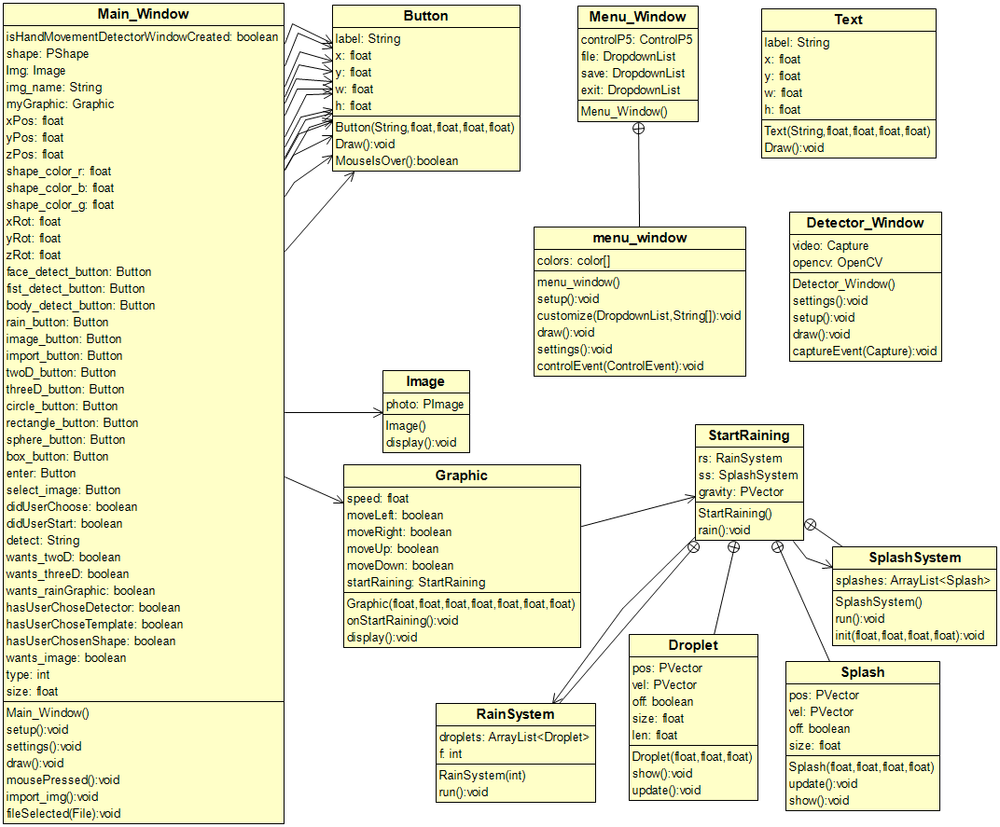

# 1984-generative-graphics: Processing
After using a combination of OpenPose and OpenFrameworks, we realized that these two required way an absurd amount of external imports and libraries in order to not only intergate these two with others, but to run the project in general. For a software, this would be somewhat unfeasible for others to use, particularly if they are not familiar with tech and programming. So, we decided to switch to Processing. Processing is another library that creates graphics, but has many built in features that are included in OpenPose and OpenFrameworks has but does not need any external libraries. It is much easier for other users to use, as processing can be used on any OS with ease, which is a problem we had in the past.

# Libraries Used
- OpenCV for processing: [github repository](https://github.com/atduskgreg/opencv-processing) [documentation](http://atduskgreg.github.io/opencv-processing/reference/)
- PShape: [documentation](https://processing.github.io/processing-javadocs/core/processing/core/PShape.html)
- Video for processing: [github repository](https://github.com/processing/processing-video)

# To run

1. [Download](https://processing.org/download/) Processing.

2. Install the above listed libraries.

    To install library, in IDE go to: 
    Sketch -> Import Libarary -> Add Library
    
    If any supporting library for the application is missing, errors could be seen in the IDE console. In that case install those libraries as well.

3. Copy "fist.xml" file to:

    ..\Processing\libraries\opencv_processing\library\cascade-files\

    File could be found in "main_window" directory. It detects actor's fist.

4. Double click on the file "main_window.pde" and run using play button in IDE. Applictaion should start.

    Happy playing!!

# Source Code
- On the OpenCV for processing github repository, they included many examples for users to test the libraries. One of the main examples that we used and took code from is this [example](https://github.com/atduskgreg/opencv-processing/tree/master/examples/LiveCamTest).
- To create the shapes, images, and custom shapes feature, we referenced to the code in the PShape documentaton found [here](https://processing.org/tutorials/pshape/).
- To create the GUI, we referenced the code from [here](https://www.kasperkamperman.com/blog/processing-code/controlp5-library-example1/).
- To create the Menu Bar, we referenced code from a forum page found [here](https://forum.processing.org/two/discussion/12202/is-there-a-way-to-associate-a-menu-bar-with-the-sketch-frame).
- To create the 3D Rain Scene, we referenced the code from [here](https://discourse.processing.org/t/simple-3d-rain-simulation/10834)
- To create the 3D shapes {BOX, SPHERE}, we referenced code from [here](https://processing.org/examples/primitives3d.html)

# Issues
- There is a major issue with the Video library is using a Mac with Catalina installed. Because of the new install, all 32 bit applications are deprecation, one of which is the Video Library. A work around this is to manually clone the beta version of the library (found [here](https://github.com/processing/processing-video/releases/tag/r6-v2.0-beta4))
and manually install it (in the Mac, directly install it in /Documents/Processing/Libraries). 

**Warning:** In using MacOSX, There is a lot of external libraries in this library that cannot be detected by Mac so it will be annoying and give you a warning saying that this library cannot be used as Apple cannot verify the library. A way around this is to open every single file, and then manually allow them to open. However, there are almost 300 files so this might take some time

# UML

This is a high level UML to get a quick insight of the project.

